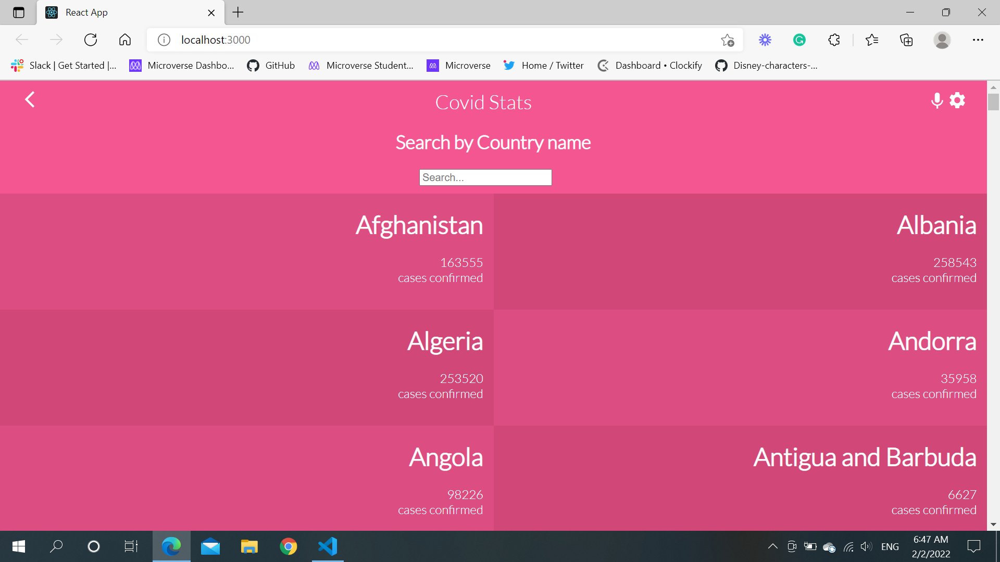
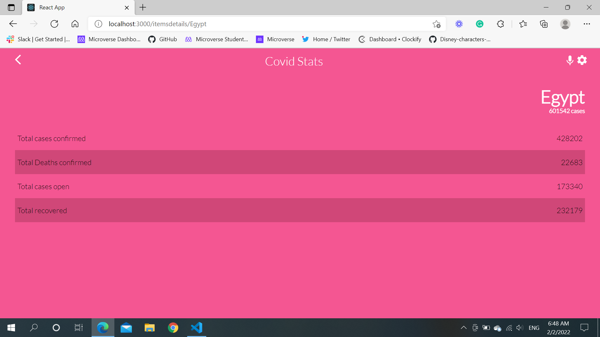

# COVID METRICS WEBAPP
- In this repo I was to select an API that provides numeric data about a topic that I would like and then build the webapp around it. The webapp will have several pages:
  - one page with a list of items that could be filtered by some parameters.
  - one page for the item details.

## Project Description
> Click [here](https://www.loom.com/share/e368cef5bca44691ac55898afa35fa68) to watch a video that gives a brief description of the project

## Live Demo
> Click [here](https://covid19tracker11.netlify.app/) to see the live demo


Countrylist page                              |  Countrydetails page
:------------------------------------------:|:------------------------------------------:
   |   

### Built With

- React.js
- HTML (Hyper-Text Markup Language)
- CSS (Cascading Style Sheets)
- JS (JavaScript)

# Getting Started with Create React App

This project was bootstrapped with [Create React App](https://github.com/facebook/create-react-app).

### Project Installation

1. Clone the repository
   ```sh
   git clone https://github.com/mohamedelshamy55/Metrics-capstone-project.git
   ```
2. Install NPM packages
   ```sh
   npm install
   ```
3. Run server
   ```sh
   npm start
   ```
## Author

👤 **Mohamed ELShamy**

- GitHub: [@mohamedelshamy](https://github.com/mohamedelshamy55) 
- Twitter: [@mohamedelshamy](https://mobile.twitter.com/moelshamy55) 
- LinkedIn: [LinkedIn](https://www.linkedin.com/in/mohamedelshamy85/) 

## 🤝 Contributing

Contributions, issues, and feature requests are welcome!

Feel free to check the [issues page](https://github.com/mohamedelshamy55/Metrics-capstone-project/issues).

## Acknowledgments
Microverse

React and React Router documentation

Hats off to [Nelson Sakwa](https://www.behance.net/sakwadesignstudio) for the design inspiration.


## Show your support
Give a ⭐️ if you like this project!
